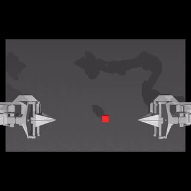

# Hugging Face Robot Examples

This repository contains quickstart example code that trains and evaluates Action Chunking Transformers (ACT) on
tasks: [ALOHA](https://github.com/huggingface/gym-aloha), [PushT](https://github.com/huggingface/gym-pusht),
and [xArm](https://github.com/huggingface/gym-xarm)

In the ALOHA `TransferCubeTask`, the right arm of a robot needs to pick up a red cube
and place it inside the gripper of the left arm.

View my training & evaluation graphs: https://api.wandb.ai/links/kldsrforg/60wui44j

---

### What is an Action Chunking Transformer (ACT)?

An Action Chunking Transformer is a novel imitation learning algorithm designed to handle the complexities of
fine-grained robotic manipulation tasks. It leverages the strengths of action chunking and the Transformer
architecture to improve the learning and execution of these tasks.

### ACT Key Concepts

1. **Action Chunking**:
    - **Definition**: Action chunking refers to grouping a sequence of actions together and treating them as a single
      unit. Instead of predicting one action at a time, the model predicts a sequence of actions for multiple timesteps.
    - **Purpose**: This reduces the effective horizon of the task, which helps in mitigating the compounding error
      problem. Compounding errors occur when small prediction errors accumulate over time, leading the robot to states
      that are outside the training distribution and causing task failures.
    - **Implementation**: In the context of the Action Chunking Transformer, the policy models the probability
      distribution of a sequence of actions given the current observation.

2. **Transformer Architecture**:
    - **Transformers**: Originally designed for natural language processing tasks, Transformers are effective at
      handling sequence data and capturing long-range dependencies.
    - **Encoder-Decoder Structure**: In this implementation, the Transformer encoder processes the observation inputs
      (including visual data and joint positions), and the Transformer decoder predicts the sequence of actions.
    - **Conditional Variational Autoencoder (CVAE)**: The Action Chunking Transformer uses a CVAE to handle the
      variability in human demonstrations. The CVAE encoder compresses the observed actions and joint positions into a
      latent variable `z`, which the decoder then uses, along with the observations, to predict the sequence of
      actions.

3. **Temporal Ensembling**:
    - **Definition**: Temporal ensembling involves averaging the predictions of overlapping action chunks to produce
      smoother and more accurate trajectories.
    - **Purpose**: This technique addresses the potential issue of abrupt changes between action chunks and ensures
      smoother transitions by incorporating new observations continuously and averaging the predicted actions.
    - **Implementation**: The policy is queried at each timestep, producing overlapping chunks of actions. These
      predicted actions are then combined using an exponential weighting scheme, which prioritizes more recent
      predictions but still takes older ones into account.

### ACT Workflow

1. **Data Collection**:
    - Human demonstrations are collected using a teleoperation system. The joint positions of the leader robot (operated
      by the human) are recorded as the actions, and observations include images from multiple cameras and the joint
      positions of the follower robot.

2. **Training**:
    - The CVAE encoder processes the collected data to learn a latent representation `z`.
    - The Transformer decoder, conditioned on `z` and the current observations, predicts the sequence of future
      actions.
    - The model is trained to minimize the reconstruction loss (difference between predicted and actual actions) and the
      KL-divergence regularization loss to ensure the latent space is well-structured.

3. **Inference**:
    - During execution, the policy generates action sequences based on the current observation and the mean of the prior
      distribution of `z`.
    - Temporal ensembling is applied to combine predictions from overlapping action chunks, ensuring smooth and precise
      motion.

### ACT Advantages

- **Reduction of Compounding Errors**: By predicting action sequences, the effective horizon is reduced, and errors do
  not compound as rapidly.
- **Handling of Non-Markovian Behavior**: Action chunking can manage pauses and other non-Markovian behaviors in human
  demonstrations, improving the robustness of the policy.
- **Smooth and Precise Actions**: Temporal ensembling helps in producing smooth and accurate actions, which are crucial
  for fine-grained manipulation tasks.

